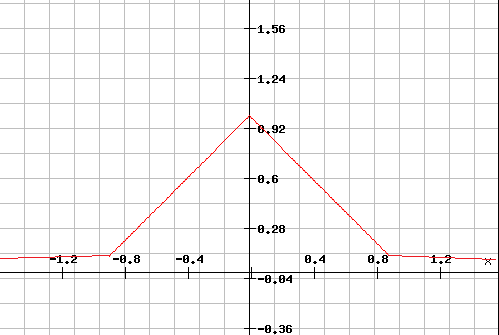
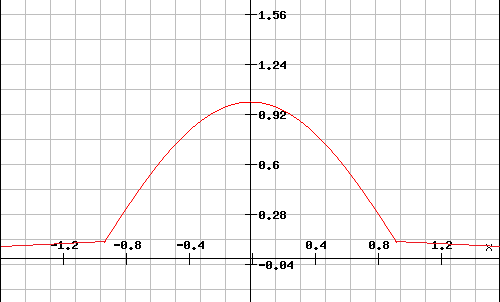
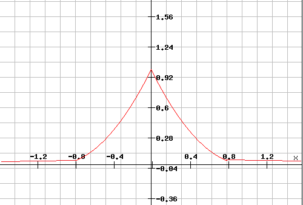

# es_geo_adaptive_distance
Elasticsearch geo distance plugin. More close more score.

It works like in-built "geo_distance" query. There are 2 differences:

1) score isn't 0 or 1. It's in range (0, 1]

2) you can specify a function that calculates a score: "linear" (default), "cosinus", "x2"

Versions
------------

| elasticsearch version | latest version  |
| --------------------- | --------------- |
| 2.2                   | v2.2.0          |

Installation
------------

Install it like so for Elasticsearch 2.2.x:
```bash
./bin/plugin remove geo-adaptive-distance-query
./bin/plugin install file:///home/me/geo_adaptive_distance_query-2.2.0.zip
```

```json
"geo_adaptive_distance": {
  "distance": "50km",
  "curve": "cosinus",
  "manufacture": {
    "lat": 40,
    "lon": -70
  }
}
```

Screenshots
------------
####linear (default)


####cosinus


####x^2



